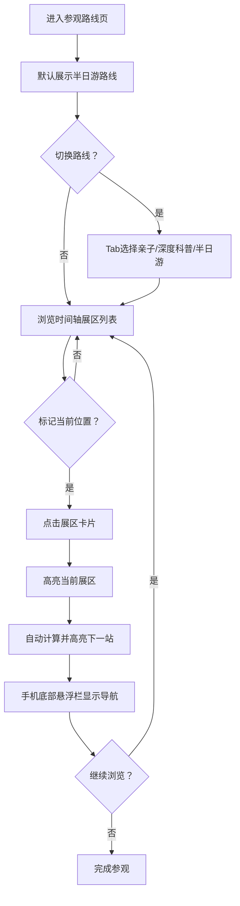

## 1. 产品概述
天文馆参观路线指引页面，为参观者提供三条精选路线（亲子路线、深度科普路线、半日游路线），串联球幕影院、陨石展、望远镜区和文创店四个核心展区，帮助观众高效规划参观行程，手机端可快速定位当前展区的下一站。

- 目标用户：天文馆参观者，包括亲子家庭、科普爱好者、短时观光游客
- 核心价值：优化参观体验，减少路线规划时间，确保不错过重点展区

## 2. 核心功能

### 2.1 功能模块
1. **路线选择区**：Tab切换三条参观路线，展示各路线总时长与特色标签
2. **路线时间轴**：可视化展示路线节点顺序，每个展区卡片显示预计停留时间
3. **展区详情卡片**：展示展区名称、停留时间、简介、图标标识
4. **当前位置快速导航**：手机端底部悬浮"我在这"按钮，一键标记当前展区并高亮下一站
5. **路线进度追踪**：已参观节点标记、当前节点高亮、剩余节点指示
6. **总览信息**：路线总时长、参观建议、开场提示

### 2.2 页面详情
| 页面名称 | 模块名称 | 功能描述 |
|-----------|-------------|---------------------|
| 参观路线页 | 顶部横幅 | 页面标题、星空背景、副标题说明 |
| 参观路线页 | 路线选择Tab | 亲子/深度科普/半日游三条路线切换，含图标和标签 |
| 参观路线页 | 路线概览信息 | 展示所选路线的总时长、展区数量、适合人群 |
| 参观路线页 | 时间轴展区列表 | 垂直时间轴连接各展区，按顺序排列，每个卡片含停留时间 |
| 参观路线页 | 展区详情内容 | 展区名称、建议停留时间、展区描述、特色亮点 |
| 参观路线页 | 下一站快速定位 | 点击展区卡片标记为当前位置，自动高亮下一站 |
| 参观路线页 | 底部悬浮导航栏 | 手机端固定底部，显示当前位置+下一站快捷入口 |

## 3. 核心流程
用户进入页面后，默认展示半日游路线；可通过顶部Tab切换不同路线；浏览各展区详情时，点击任意展区可标记为"我在这里"，系统自动高亮下一个展区并在手机底部显示导航提示；用户可随时切换路线，进度状态保持独立。

## 4. 用户界面设计

### 4.1 设计风格
- **主色调**：深空蓝 #0a1628，星夜紫 #1a1a3e，极光青 #2dd4bf
- **辅助色**：陨石橙 #f59e0b，星云粉 #ec4899，月光白 #f8fafc
- **按钮样式**：圆角胶囊按钮，渐变边框，悬浮微发光效果
- **字体**：展示字体使用 Orbitron（科技感），正文字体使用 Noto Sans SC（易读性）
- **布局风格**：卡片式+时间轴组合，深色星空背景配星座连线装饰
- **图标风格**：线性发光图标，配合天文主题emoji点缀
- **整体氛围**：沉浸式宇宙星空体验，带微妙闪烁星点动画

### 4.2 页面设计概述
| 页面名称 | 模块名称 | UI元素 |
|-----------|-------------|-------------|
| 参观路线页 | 顶部横幅 | 深色渐变背景+动态星点闪烁，大号标题居中，副标题小字 |
| 参观路线页 | 路线选择Tab | 三个胶囊Tab，选中态发光边框+背景渐变，未选中态半透明 |
| 参观路线页 | 路线概览信息 | 三个数据块横向排列：总时长、展区数、适合人群，配图标 |
| 参观路线页 | 时间轴展区列表 | 左侧垂直发光时间轴线，节点用圆形图标，卡片与时间轴交错排列 |
| 参观路线页 | 展区详情卡片 | 深色半透明玻璃拟态卡片，左侧大图标，右上停留时间标签，下接描述文字 |
| 参观路线页 | 当前/下一站高亮 | 当前展区加脉冲发光边框，下一站加箭头指示器和"下一站"角标 |
| 参观路线页 | 底部悬浮导航栏 | 手机端固定底部，毛玻璃效果，左当前位置，右"前往下一站"按钮 |

### 4.3 响应式
- **桌面端**：最大宽度1200px居中，时间轴左侧展示，卡片左右交替布局
- **平板端**：宽度适配，卡片改为单侧排列
- **手机端**：单列布局，时间轴简化为左侧细线，底部悬浮导航栏常驻，触控区域≥44px
- **触控优化**：所有可点击区域增大热区，滑动切换路线支持

### 4.4 视觉动效
- 页面加载：星点渐次浮现，Tab和卡片依次淡入+上移
- 路线切换：Tab切换带水平滑动过渡，内容区淡入淡出
- 当前位置标记：脉冲光圈动画，下一站箭头滑入
- 悬浮交互：卡片悬浮轻微上浮+阴影加深，图标微旋转
