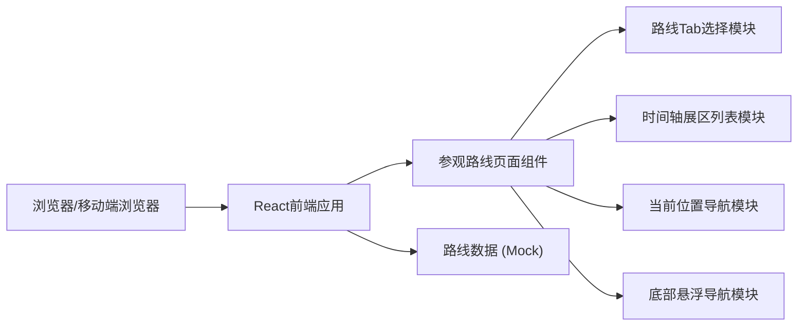

## 1. 架构设计



## 2. 技术描述
- **前端框架**：React@18 + TypeScript
- **构建工具**：Vite@5
- **样式方案**：Tailwind CSS@3 + 自定义CSS动画
- **状态管理**：React Hooks (useState, useEffect) 本地状态管理
- **图标方案**：自定义SVG图标组件 + emoji
- **字体方案**：Google Fonts (Orbitron + Noto Sans SC)
- **数据来源**：前端Mock数据，无需后端服务

## 3. 路由定义
| 路由 | 用途 |
|-------|---------|
| / | 参观路线主页面 |

## 4. 数据模型

### 4.1 路线数据结构
```typescript
interface ExhibitionZone {
  id: string;
  name: string;
  duration: number; // 分钟
  description: string;
  highlights: string[];
  icon: string; // emoji或svg名称
  color: string; // 主题色
}

interface Route {
  id: 'family' | 'deep' | 'halfday';
  name: string;
  tagline: string;
  totalDuration: number;
  audience: string;
  tags: string[];
  zones: string[]; // ExhibitionZone id数组，按顺序排列
}

type CurrentLocation = {
  routeId: string;
  zoneIndex: number;
};
```

### 4.2 四个核心展区
1. 球幕影院（Dome Theater）：30-45分钟
2. 陨石展（Meteorite Exhibition）：20-30分钟
3. 望远镜区（Telescope Area）：25-40分钟
4. 文创店（Gift Shop）：15-20分钟

## 5. 核心组件结构
```
src/
├── App.tsx                 # 根组件
├── main.tsx               # 入口文件
├── index.css              # 全局样式 + Tailwind
├── data/
│   └── routes.ts          # Mock路线和展区数据
├── components/
│   ├── HeroBanner.tsx     # 顶部星空横幅
│   ├── RouteTabs.tsx      # 路线选择Tab
│   ├── RouteOverview.tsx  # 路线概览信息
│   ├── Timeline.tsx       # 时间轴展区列表
│   ├── ZoneCard.tsx       # 单个展区卡片
│   └── FloatingNav.tsx    # 手机端底部悬浮导航
└── types/
    └── index.ts           # TypeScript类型定义
```

## 6. 关键实现要点
1. **星空背景**：使用CSS径向渐变+多层伪元素+JS动画生成随机星点
2. **时间轴连线**：使用CSS ::before伪元素绘制垂直发光线，节点用border-radius圆形
3. **脉冲发光动画**：使用CSS @keyframes box-shadow动画实现当前展区呼吸灯效果
4. **路线切换过渡**：React key + CSS transition实现内容区平滑切换
5. **下一站计算逻辑**：根据当前zoneIndex，取下一个索引的展区，若为最后一个则提示完成
6. **响应式断点**：Tailwind sm(640px)/md(768px)/lg(1024px)三级断点适配
7. **触控支持**：触摸目标最小44x44px，添加touch-action: manipulation优化
